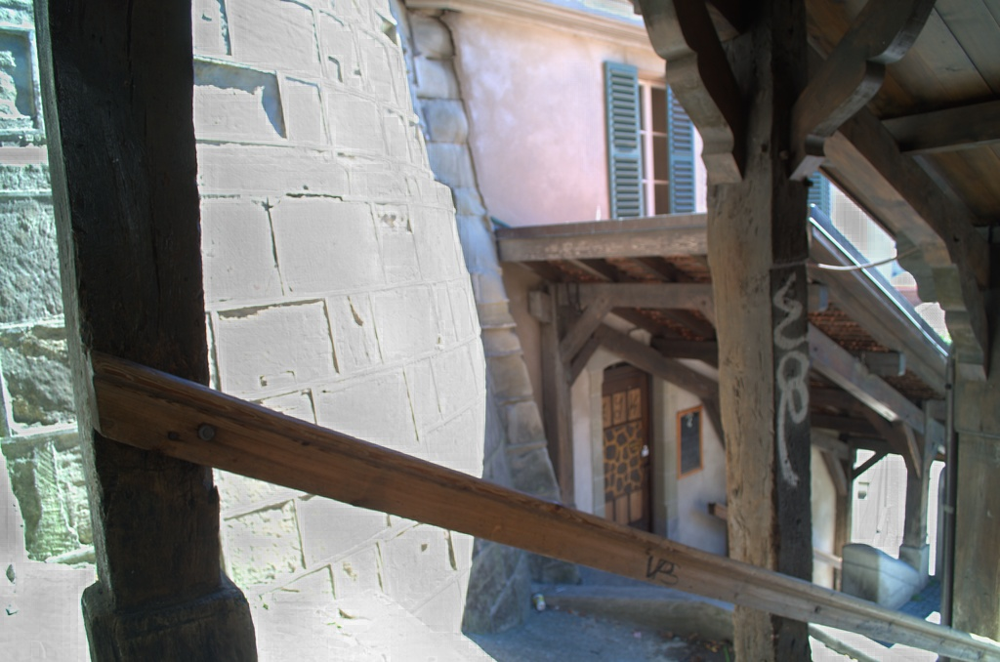

# Visual and Near-Infrared Image Fusion

## Description
This ongoing project is for my Senior Thesis at the University of Illinois. This project has many parts to it, including literature review and progress reports focusing on specific aspects of the project. For instance, in [Wavelet Evaluation Report](./Wavelet_Evaluation.pdf), I explored using different levels of the wavelet decomposition for better image enhancement results.

My research is focused on image enhancement with visual (VIS) and near-infrared (NIR) images in an embedded setting. 

## File Descriptions 

- **[Topic Statement](./Topic_Statement.pdf)**
  - Definition of research problem.

- **[Literature Review](./Literature_Review.pdf)**
  - Overall summary of various papers about image enhancement algorithms using NIR images.

- **[Progress Report 1](./Progress_Report_1.pdf)**
  - Report focuses on the embedded system used to capture the VIS and NIR images

- **[Progress Report 2](./Progress_Report_2.pdf)**
  - Report focuses on implementing enhancement algorithm proposed by Zhang et al. [here](./Zhang_Paper.pdf).

- **[Wavelet Evaluation Report](./Wavelet_Evaluation.pdf)**
  - Report focuses on the development and analysis of a mutlilevel wavelet image enhancement algorithm.

## Example

<table>
  <tr>
    <td align="center">
      
       VIS Image
    </td>
    <td align="center">
      
       NIR Image
    </td>
    <td align="center">
      
       Enhanced VIS Image
    </td>
  </tr>
</table>

## Applications

- Remote Sensing
- Shadow Detection
- Self-Driving Cars

### Note
I did not include any of my code for this project since it is still ongoing.

